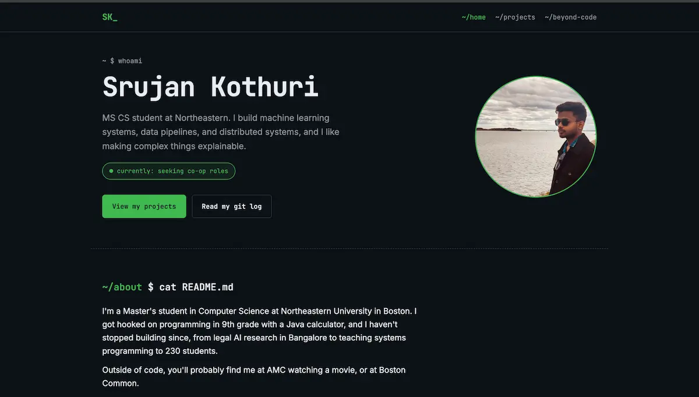

# Srujan Kothuri: Personal Homepage

A personal homepage that introduces who I am, what I've built, and what I enjoy outside of code, built entirely with vanilla HTML5, CSS3, and ES6 modules.

**Live site:** https://srujankothuri.github.io/srujanhomepage/

## Author

**Srujan Kothuri**

- GitHub: [@srujankothuri](https://github.com/srujankothuri)
- LinkedIn: [in/srujankothuri](https://www.linkedin.com/in/srujankothuri)

## Class

[CS 5610 Web Development (Online), Northeastern University, Fall 2026](https://johnguerra.co/classes/webDevelopment_online_fall_2026/), taught by [John Alexis Guerra Gómez](https://johnguerra.co).

## Project Objective

Create a personal homepage that introduces me as a person and a developer: my background, my projects and research, and my interests beyond code, presented in a way that is memorable, accessible, and clearly my own.

The site's creative component is my life journey rendered as an **interactive git commit graph**. Each milestone, from my first Java program in 2017 to my MS at Northeastern, is a commit on one of four branches (`main`, `work`, `research`, and `personal`). Visitors can select any commit to read its details, styled like the output of `git show`.

## Creative Component

**What:** my life journey rendered as an interactive git commit graph.

**Where:** the Journey section of the Home page (`index.html`). The milestone
data is in `js/commits.js`, and `js/journey.js` draws the graph and handles
selection and keyboard navigation.


## Screenshot



## Pages

| Page        | File               | What's on it                                                                    |
| ----------- | ------------------ | ------------------------------------------------------------------------------- |
| Home        | `index.html`       | Introduction, about me, the interactive journey graph, and contact links        |
| Projects    | `projects.html`    | A featured research publication and a filterable gallery of projects            |
| Beyond Code | `beyond-code.html` | Movies, sports, hackathons, and life in Boston in an animated bento-grid layout |

## Features

- **Interactive git commit graph:** the graph is generated from data in `js/commits.js`. Each commit lists its parent commits, and `js/journey.js` computes every line, fork, and merge from those links, so adding a milestone is a one-line change.
- **Project filters:** filter the project gallery by area (ML, Data, Systems, Web), with the result announced to screen readers.
- **Bento-grid Beyond Code page:** glass tiles with a cursor-following glow, a gradient heading, and tiles that reveal on scroll.
- **Accessibility:** semantic HTML, a skip link, keyboard navigation (including arrow keys in the commit graph), visible focus styles, descriptive alt text, and all animations disabled when "reduce motion" is turned on.
- **Responsive design:** layouts built with CSS Grid and Flexbox that adapt from phone to desktop.

## Technologies

- HTML5, CSS3 (Grid, Flexbox, custom properties), and JavaScript (ES6 modules)
- No frameworks or libraries
- Fonts: JetBrains Mono and Inter, from Google Fonts
- Tooling: ESLint (class configuration) and Prettier
- Hosting: GitHub Pages

## Instructions to Build

### Prerequisites

- [Node.js](https://nodejs.org/) (LTS version)
- [Git](https://git-scm.com/)

### Run it locally

1. Clone the repository:

   ```bash
   git clone https://github.com/srujankothuri/srujanhomepage.git
   cd srujanhomepage
   ```

2. Install the development tools:

   ```bash
   npm install
   ```

3. Start a local server:

   ```bash
   npm start
   ```

4. Open the address shown in the terminal (usually http://localhost:3000).

A local server is required because ES6 modules don't load when an HTML file is opened directly from the file system.

### Check code quality

```bash
npm run lint           # ESLint with the class configuration
npm run format:check   # Check Prettier formatting
npm run format         # Apply Prettier formatting
```

## Project Structure

```
srujanhomepage/
├── index.html            # Home page
├── projects.html         # Projects page
├── beyond-code.html      # Beyond Code page
├── css/
│   ├── style.css         # Shared styles for all pages
│   └── beyond-code.css   # Styles specific to the Beyond Code page
├── js/
│   ├── main.js           # Entry point for the Home and Projects pages
│   ├── commits.js        # Journey milestones data
│   ├── journey.js        # Renders the interactive commit graph
│   ├── filters.js        # Project filter buttons
│   └── beyond-code.js    # Effects for the Beyond Code page
├── images/               # Photos, project images, and the favicon
└── docs/
    ├── design-document.md
    └── mockups/          # Wireframes for each page
```

## Use of GenAI

### Beyond Code page

- **Tool and model:** Claude Opus 5.5 (Anthropic), used through claude.ai.
- **What was generated:** `beyond-code.html`, `css/beyond-code.css`, and
  `js/beyond-code.js`.
- **Prompt:** a single detailed prompt specifying the page's content (my
  movies, Boston, sports, hackathons, and quick stats), a four-column bento
  layout with tablet and phone versions, the visual effects (glass tiles, a
  cursor-following glow, a gradient heading, and scroll-reveal animations), and
  every project rule: vanilla HTML, CSS, and ES6 modules only, no inline styles
  or `!important`, semantic HTML, alt text, W3C and ESLint compliance, and
  respect for reduced-motion settings.
- **Changes after generation:**
  - Fixed misaligned wrapped lines in list items by switching from a
    hanging indent to a flexbox layout.
  - Added a wider aspect ratio for the Boston photo on tablets, where the
    full-width tile made it too tall.
  - Updated the photo's alt text to describe my actual photo.

## Design Document

The design document, including the project description, user personas, user stories, and mockups, is in [`docs/design-document.md`](docs/design-document.md).

## License

This project is licensed under the [MIT License](LICENSE).
