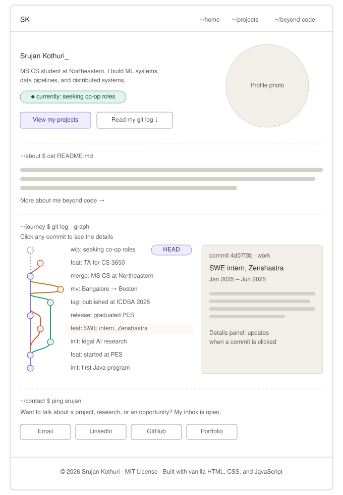
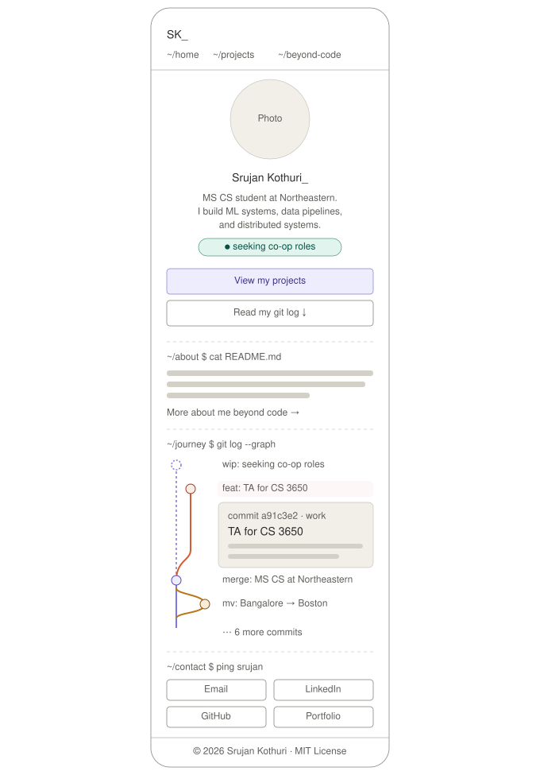
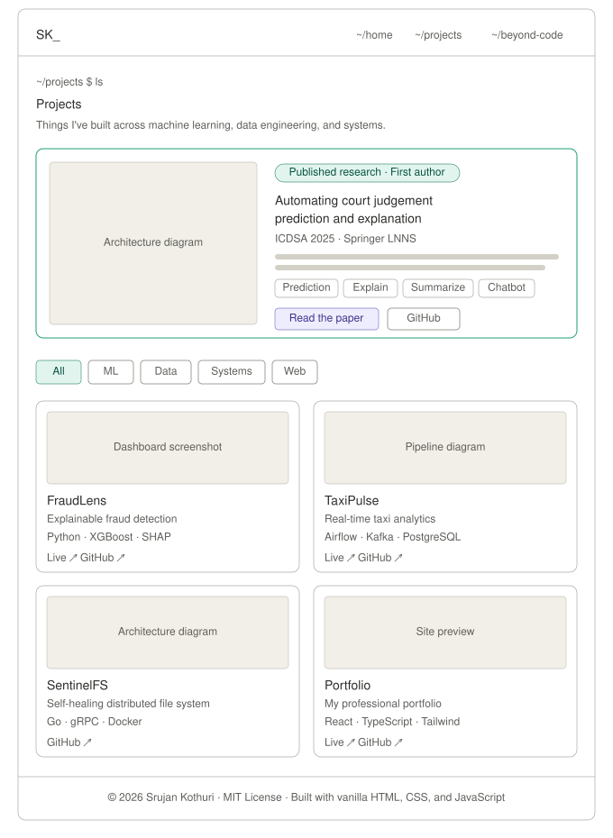
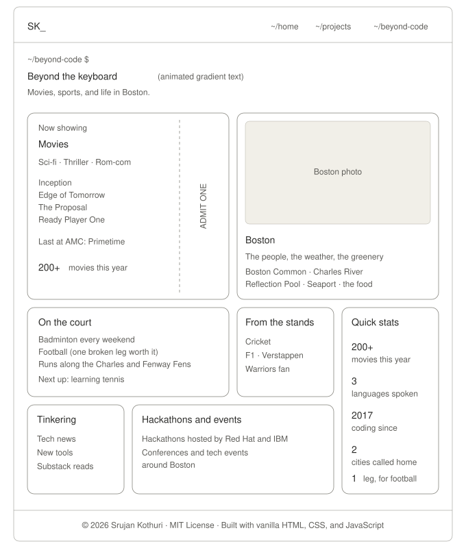

# Design Document: Srujan Kothuri's Personal Homepage

**Author:** Srujan Kothuri
**Course:** Web Development, Northeastern University
**Project:** Project 1, Personal Homepage
**Live site:** https://srujankothuri.github.io/srujanhomepage/

---

## 1. Project Description

### Overview

A personal homepage that introduces who I am, what I've built, and what I enjoy outside of code.

Its standout feature is my life journey rendered as an **interactive git commit graph**. Each milestone, from writing my first Java program in 2017 to starting my MS at Northeastern, is a commit on one of four branches: `main` (education and life), `work`, `research`, and `personal`. Visitors can click any commit to open a details panel, styled like the output of `git show`, that explains what happened and why it mattered.

### Objective

Create a page that introduces me as a person and a developer: my background, my projects and research, and my interests beyond code, presented in a way that is memorable, accessible, and clearly my own.

### Pages

| Page        | File               | Purpose                                                                                                      |
| ----------- | ------------------ | ------------------------------------------------------------------------------------------------------------ |
| Home        | `index.html`       | Introduction, about me, the interactive journey graph, and contact links                                     |
| Projects    | `projects.html`    | A featured research publication and a filterable gallery of projects across ML, data, systems, and web       |
| Beyond Code | `beyond-code.html` | Movies, sports, hackathons, and life in Boston in an animated bento-grid layout (AI-generated, then refined) |

### Technologies

- **HTML5**, with semantic elements throughout
- **CSS3**, using native Grid and Flexbox, CSS custom properties, and no frameworks
- **JavaScript (ES6+)**, written entirely as ES6 modules, with no libraries or frameworks
- **Fonts:** JetBrains Mono (headings and accents) and Inter (body text), from Google Fonts
- **Tooling:** ESLint (class configuration) and Prettier
- **Hosting:** GitHub Pages

The Beyond Code page was generated with a GenAI tool and then revised to meet every project requirement. Details are documented in the README.

---

## 2. User Personas

### Persona 1: Maya Chen, Software Engineer and Hiring Manager

- **Age:** 34
- **Location:** Boston, MA
- **Tech comfort:** Expert
- **Background:** Leads a backend team at a mid-size Boston tech company and screens co-op candidates.
- **Goals:** Understand quickly who a candidate is and what they've actually built, and see real code on GitHub.
- **Frustrations:** Portfolios that bury projects under long bios, and sites that break on her phone between meetings.
- **Uses most:** The hero status line, the journey graph, project cards with GitHub links, and contact links.

### Persona 2: Arjun Mehta, Fellow MS CS Student

- **Age:** 24
- **Location:** Boston, MA
- **Tech comfort:** High
- **Background:** A classmate who met me in a course and is looking for a hackathon teammate.
- **Goals:** See what I'm good at and whether our skills complement each other.
- **Frustrations:** Having to scroll through everything when he only cares about one area.
- **Uses most:** The project filter buttons, tech tags, and the hackathons tile on Beyond Code.

### Persona 3: Dr. Elena Rossi, Legal AI Researcher

- **Age:** 45
- **Location:** Milan, Italy
- **Tech comfort:** Moderate
- **Background:** Researches explainable AI for legal systems and came across my ICDSA 2025 paper.
- **Goals:** Read the paper, understand the approach, and possibly reach out about collaboration.
- **Frustrations:** Heavy jargon without context, and research buried among unrelated projects.
- **Uses most:** The featured research section, the paper link, the plain-English summary, and contact links.

### Persona 4: Jordan Williams, Someone I Met at a Boston Tech Event

- **Age:** 29
- **Location:** Boston, MA
- **Tech comfort:** Low to moderate (works in product marketing)
- **Background:** Chatted with me at a tech meetup and looked me up afterward.
- **Goals:** Remember who I am, learn a bit more about me as a person, and stay in touch.
- **Frustrations:** Sites that are all code and technical terms, with nothing personal.
- **Uses most:** The About section, the Beyond Code page, and the LinkedIn link.

### Why these personas

Together, they cover the full range of the site's audience, from expert to non-technical and from professional to personal. Each one leads naturally to a different page. Jordan, in particular, justifies the Beyond Code page and requires the journey graph to make sense to non-developers, which is why every commit message is written as a plain sentence.

---

## 3. User Stories

### Story 1: Maya screens a candidate between meetings

> Maya has ten minutes before her next meeting and three co-op applications to review. She opens Srujan's homepage on her phone from the link in his application. Within seconds, the hero tells her who he is, what he builds, and that he's currently seeking co-op roles. She taps "Read my git log" and scrolls the journey graph: a published paper, a software engineering internship, and a TA role for 230 students. She taps the Zenshastra commit to read what he built there. Convinced, she opens the Projects page, checks FraudLens on GitHub, and saves the page to share with her team.

**Features this requires:** a clear hero with a status line, a responsive layout that works on phones, clickable commits with detail panels, and GitHub links on project cards.

### Story 2: Arjun looks for a hackathon teammate

> Arjun is forming a team for a hackathon focused on distributed systems, and he remembers Srujan mentioning a file system project in class. He visits the Projects page and taps the "Systems" filter. The grid instantly narrows to SentinelFS and TaxiPulse. He reads the one-line descriptions, scans the tech tags (Go, gRPC, Kafka), and sees exactly the skills his team is missing. On the Beyond Code page, he notices Srujan has already done hackathons hosted by Red Hat and IBM. He messages him on LinkedIn that evening.

**Features this requires:** filter buttons by category, projects that can belong to multiple categories, tech tags on every card, and the hackathons tile on Beyond Code.

### Story 3: Dr. Rossi discovers the research

> Dr. Rossi finds Srujan's name as first author of an ICDSA paper on explaining court judgment predictions, close to her own work. She searches for him and lands on his homepage. The Projects page opens with the research featured at the top, so she doesn't have to hunt for it. The plain-English summary explains the problem and the four parts of the system before any technical details. She follows the link to the paper on Springer, then returns to the contact section to email him about a possible collaboration.

**Features this requires:** a featured research section at the top of the Projects page, a plain-English summary, direct links to the paper and code, and an easy-to-find contact section.

### Story 4: Jordan reconnects after a meetup

> Jordan met Srujan at a tech event in Boston and enjoyed their conversation about movies. A few days later, she looks up his homepage. The technical terms go over her head, but the journey graph still makes sense: each commit reads like a plain sentence, such as "moved from Bangalore to Boston." She clicks through to Beyond Code and laughs at the "1 leg broken for football" stat. She finds they've both seen _Inception_ more times than they'd admit, and connects with him on LinkedIn with a note about it.

**Features this requires:** plain-English commit messages, the Beyond Code page with personal tiles, the Quick Stats tile, and a LinkedIn link.

### Story 5: Maya navigates without a mouse

> Maya prefers the keyboard, and she often reviews candidates on a laptop with no mouse attached. On Srujan's homepage, she presses Tab and moves through the navigation, the hero links, and then each commit in the journey graph, with a clear focus outline showing where she is. Pressing Enter opens a commit's details. On the Projects page, the filter buttons work the same way. She never has to reach for a mouse.

**Features this requires:** commits built as real `<button>` elements, visible focus styles, keyboard-operable filters, and semantic HTML throughout.

### Feature coverage

| Feature                  | Stories    |
| ------------------------ | ---------- |
| Hero and status line     | 1          |
| Journey commit graph     | 1, 4, 5    |
| Featured research        | 3          |
| Project filters          | 2, 5       |
| Beyond Code page         | 2, 4       |
| Contact and social links | 1, 2, 3, 4 |
| Responsive design        | 1          |
| Keyboard accessibility   | 5          |

---

## 4. Design Mockups

### Home page (desktop)

- A two-column hero: introduction on the left, profile photo on the right.
- Section headings styled as terminal commands, such as `~/about $ cat README.md`.
- The journey graph and its details panel sit side by side, so visitors can read a commit without losing their place. The panel shows the `HEAD` commit on first load, so it's never empty.

### Home page (mobile)

- The hero stacks vertically, with full-width buttons that are easy to tap.
- Navigation stays visible as three short links, since a hamburger menu would add an extra tap for only three pages.
- The details panel opens directly under the tapped commit, like an accordion.

### Projects page (desktop)

- The featured research card spans the full width with an accent border.
- The filter buttons sit below the featured section and only affect the project grid, so the research is always visible.
- A 2×2 grid gives every card the same structure: image, title, one-line description, tags, and links.
- On mobile, everything becomes a single column.

### Beyond Code page (desktop)

- A bento grid of seven tiles of mixed sizes. Movies and Boston get the two large tiles.
- The movie tile is styled as a cinema ticket, with a perforated edge and an "ADMIT ONE" stub.
- The uneven lower rows, including a tall Quick Stats tile, create the bento look.
- The grid drops to two columns on tablets and one column on phones.

---

## 5. Supporting Design Decisions

### The creative component: a journey as a git commit graph

| Date     | Branch   | Commit message                             |
| -------- | -------- | ------------------------------------------ |
| Now      | main     | `wip: seeking co-op roles` (HEAD)          |
| Aug 2026 | work     | `feat: TA for CS 3650 Computer Systems`    |
| Sep 2025 | main     | `merge: started MS CS at Northeastern`     |
| Sep 2025 | personal | `mv: Bangalore → Boston`                   |
| Jul 2025 | research | `tag: published at ICDSA 2025`             |
| May 2025 | main     | `release: graduated from PES University`   |
| Jan 2025 | work     | `feat: SWE intern at Zenshastra`           |
| Jan 2024 | research | `init: court judgment prediction research` |
| Oct 2021 | main     | `feat: started B.E. at PES University`     |
| 2017     | main     | `init: first Java program`                 |

- **Vertical, newest on top,** like `git log --graph`, which also works well on phones.
- **Branches mirror real life:** the research branch runs alongside my degree and merges after the publication, and the internship branch merges back when it ended.
- **The top commit is a work in progress,** shown as a hollow, dashed node, because the search is still ongoing.
- **Data-driven:** the commits live in a JavaScript module, and a separate module draws the graph, so adding a milestone is a one-line change.

### Visual design

A dark, terminal-inspired theme: terminal flavor in the accents, with a clean sans-serif for reading.

| Role             | Color     |
| ---------------- | --------- |
| Background       | `#0d1117` |
| Surface          | `#161b22` |
| Border           | `#30363d` |
| Text             | `#e6edf3` |
| Muted text       | `#8b949e` |
| Accent           | `#3fb950` |
| Branch: main     | `#a78bfa` |
| Branch: work     | `#f78166` |
| Branch: research | `#2dd4bf` |
| Branch: personal | `#e3b341` |

The branch colors appear both in the graph and as project tag colors, which ties the site together visually.

### Accessibility

- Semantic HTML: `<header>`, `<nav>`, `<main>`, `<section>`, `<article>`, and `<footer>`.
- Real `<button>` elements for commits and filters, with `aria-pressed` on the active filter.
- Visible focus styles for keyboard users.
- Descriptive `alt` text on every image.
- All animations disabled when the visitor has "reduce motion" turned on.
- Text colors chosen for readable contrast against the dark background.
